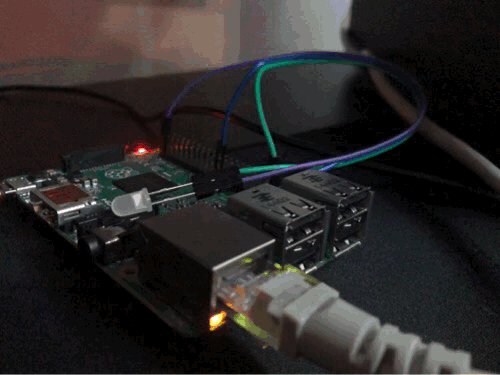

# Kura_Pi_Docker

Run kura on your raspberry pi via a docker container.


### To build:

```bash
#clone the repo
#cd into directory
docker build . -t kura_pi
```


### To run:

```bash
docker run -p 80:80 --privileged -v /dev/bus/usb:/dev/bus/usb kura_pi:latest
```


## Test Conditions

The script was tested with a raspberry pi 2 running: 

```
2019-07-10-raspbian-buster-lite.img
```

Sucess critera: flash LED attached to GPIO with Kura wires:  


